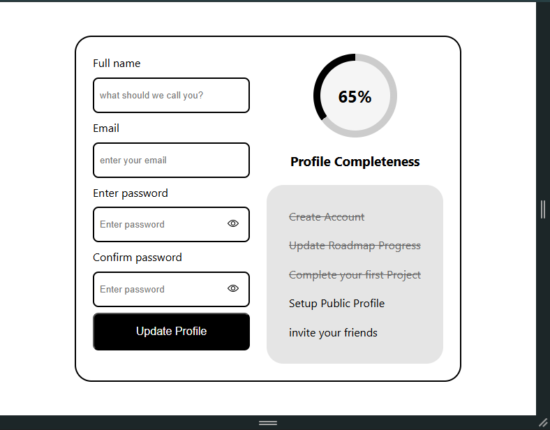
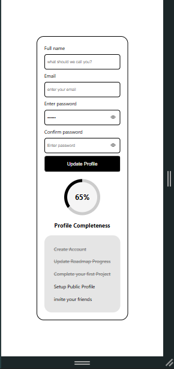

# 🧾 Accessible Form UI

A clean and accessible **Profile Update Form UI** built using **HTML & CSS**, following accessibility best practices like proper labeling, focus states, and error handling.

---

## 🚀 Live Demo
🔗 https://your-live-link.com

---

## 🗺️ Roadmap Reference
This project is inspired by frontend best practices from:

🔗 https://roadmap.sh/projects/accessible-form-ui
---

## 📸 Screenshots

### 💻 Desktop View

### 📱 Mobile View

---
## 🛠️ Tech Stack

- HTML5  
- CSS3 (Flexbox, Custom Properties)